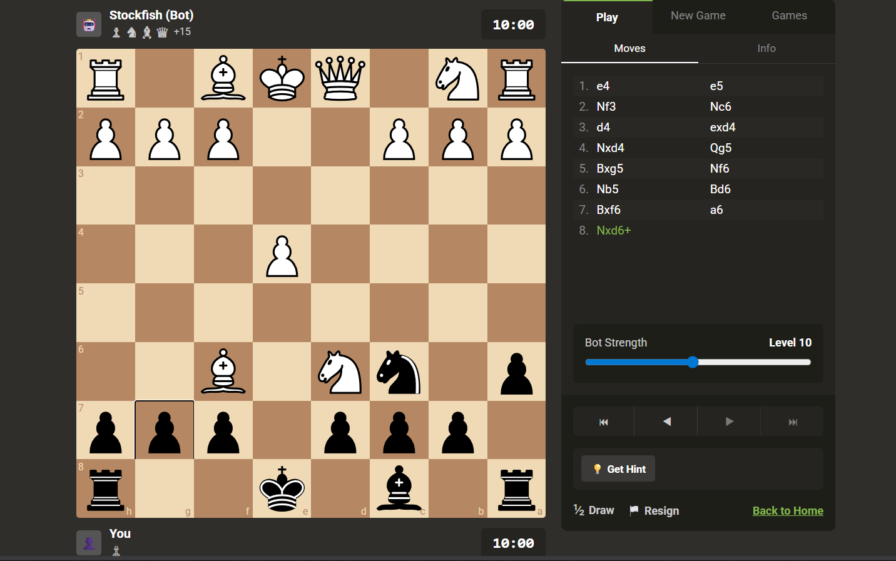

## 📸 Preview



# ♟️ AI Chess Coach Platform

A full-stack chess platform where users can play chess against an AI engine, play with friends in real time, and analyze games with coaching insights.

This project is built as a **learning project to understand real-world full-stack architecture**, including authentication, game logic, AI integration, and real-time communication.

---

## 🚀 Features

### Authentication

* User registration and login
* Secure authentication system
* User profiles and statistics

### Chess Gameplay

* Interactive chessboard UI
* Legal move validation
* Play against **Stockfish AI**
* Game state management

### Multiplayer (In Progress)

* Real-time chess with friends
* Room-based game system
* WebSocket communication

### AI Coach (Planned)

* Move suggestions
* Mistake detection
* Game analysis

### Game History

* Save matches
* Track performance
* View past games

---

## 🛠️ Tech Stack

### Frontend

* React
* react-chessboard
* chess.js
* Tailwind CSS
* Axios
* Socket.io Client

### Backend

* Node.js
* Express.js
* Socket.io
* JWT Authentication
* Stockfish Engine

### Database

* MongoDB Atlas
* Mongoose

### Deployment

* Frontend: Vercel
* Backend: Render
* Database: MongoDB Atlas

---

## 📁 Project Structure

```
chess-ai-platform
│
├── frontend
│   ├── src
│   │   ├── components
│   │   │   └── ChessBoard.jsx
│   │   ├── pages
│   │   │   └── Game.jsx
│   │   ├── services
│   │   │   └── socket.js
│   │   └── App.jsx
│
├── backend
│   ├── controllers
│   ├── models
│   ├── routes
│   ├── sockets
│   └── server.js
```

---

## ⚙️ Installation

### 1. Clone the repository

```
git clone https://github.com/yourusername/chess-ai-platform.git
```

```
cd chess-ai-platform
```

---

### 2. Install backend dependencies

```
cd backend
npm install
```

Create a `.env` file:

```
PORT=5000
MONGO_URI=your_mongodb_uri
JWT_SECRET=your_secret_key
```

Run backend server:

```
npm run dev
```

---

### 3. Install frontend dependencies

```
cd frontend
npm install
```

Run frontend:

```
npm run dev
```

---

## 🧠 How It Works

### Play vs AI

1. Player makes a move
2. Board state (FEN) is sent to the backend
3. Backend runs **Stockfish**
4. Stockfish returns the best move
5. Move is applied on the board

---

### Multiplayer System

1. Player creates or joins a room
2. Both players connect via **Socket.io**
3. Moves are broadcast in real time
4. Boards stay synchronized for both players

---

## 📚 What I Learned From This Project

* Full-stack application architecture
* Real-time communication using WebSockets
* Game state management with chess.js
* Integrating AI engines (Stockfish)
* Building scalable backend APIs
* Deploying production-ready web apps

---

## 📌 Future Improvements

* AI coaching system
* Game analysis with evaluation graph
* Rating system (ELO)
* Spectator mode
* Puzzle training
* Mobile optimization

---

## 👨‍💻 Author

Utkarsh Jeet Singh Yadav

B.Tech CSE student building full-stack and AI-powered applications.
